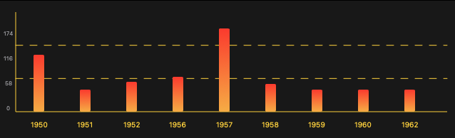

# PrettyAxis
  

A SwiftUI Framework for drawing charts.

## Fearture

- Support Drawing `Bar Chart` `RadarChart`  `Line Chart`  `Scatter Charts` `Pie Chart`  and `Donut Chart`

## Installation

#### Swift Package Manager

If you use Swift Package Manager, simply add PrettyAxis as a dependency of your package in `Package.swift`:

```swift
.package(url: "https://github.com/RiuHDuo/PrettyAxis.git", from: "main")
```

## Quick Start

Using PrettyAxis is very simple,  you can create view like this:

```swift
AxisView(style: .bar, data: values)
```

Currently  `Style` Support： `bar` `line` `radar` `scatter` `pie` and `doughnut`.

`data` is an array of any type which  implements `Axisable` Protocol.

### Axisable Protocol

The data of chart should implement this protocol. This protocol is generic, different chart style will using different type `axisable`.

`AxisView` will render the char from `Axisable` protocol data. 

For example:

If render `bar` chart, bar chart date should be return string type for `x` value of `Axisable` protocol and double type `y`. If `Axisable` protocol return `group` value, bar chart will render by group.

If render `scatter` , the data must return  string type for `x` value of `Axisable` protocol , double type `y` and double type `z`.

### Bar 

> `TestChartData` and `ChartData` see exmaple 

  ```swift
  let values = PreviewData.load([TestChartData].self, fileName: "ChartData") ?? [TestChartData]()

  let colors1 = [Color(hue: 14 / 360.0, saturation: 0.88, brightness: 0.99), Color(hue: 40 / 360.0, saturation: 0.79, brightness: 0.97)]

  let g5 = LinearGradient(colors: colors1, startPoint: UnitPoint(x: 0.5, y: 0), endPoint: UnitPoint(x: 0.5, y: 1))

   AxisView(style: .bar, data: values)
              .fill(g5) // bar color
              .fromZero(true) // axis y from zero value
              .xAxisLabelColor(Color.yellow)// axis x label color
              .referenceLine(style: ReferenceLineStyle(axisColor: Color.yellow)) // show reference line
              .spacing(50)// spacing of every bar
              .xAxisLabelFont(.caption) // font sytle of axis x
              .enableLegend(true, style: LegendStyle(labelColor: Color.white)) // show legend
              .sortXAxis(by: {$0 < $1}) // sort bar order
              .padding()
  ```

Result:



### Group Bar 

```swift
let colors2 = [Color(hue: 191 / 360.0, saturation: 0.91, brightness: 0.92), Color(hue: 280 / 360.0, saturation: 0.52, brightness: 0.93), Color(hue: 356 / 360.0, saturation: 0.68, brightness: 0.96)]

let colors3 = [Color(hue: 145 / 360.0, saturation: 0.22, brightness: 0.9),
               Color(hue: 41 / 360.0, saturation: 0.46, brightness: 0.98),
               Color(hue: 358 / 360.0, saturation: 0.51, brightness: 0.97)]
let g6 = LinearGradient(colors:  colors2, startPoint: UnitPoint(x: 0.5, y: 0), endPoint: UnitPoint(x: 0.5, y: 1))
let g7 = LinearGradient(colors: colors3, startPoint: UnitPoint(x: 0.5, y: 0), endPoint: UnitPoint(x: 0.5, y: 1))
let fill = ["London": g6, "Berlin": g7]

let values2 = PreviewData.load([TestChartData2].self, fileName: "ChartData2") ?? [TestChartData2]()

AxisView(style: .bar, data: values2)
    .fill(fill)// fill bar color
    .barWidth(30) // bar width
    .spacing(10)// spacing of every bar
    .enableValueLabel(enable: true, font: .system(size: 14).bold(),color: Color.orange)// display value label above bar
    .fromZero(true) // start value from zero
    .xAxisLabelColor(Color.yellow) // axis x lable color
    .referenceLine(style: ReferenceLineStyle(axisColor: Color.yellow)) // show referece
    .enableLegend(true, style: LegendStyle(labelColor: Color.white))// show legend
    .padding()
```

Result:


### Line

```swift
let colors1 = [Color(hue: 14 / 360.0, saturation: 0.88, brightness: 0.99), Color(hue: 40 / 360.0, saturation: 0.79, brightness: 0.97)]
let colors2 = [Color(hue: 191 / 360.0, saturation: 0.91, brightness: 0.92), Color(hue: 280 / 360.0, saturation: 0.52, brightness: 0.93), Color(hue: 356 / 360.0, saturation: 0.68, brightness: 0.96)]

let colors3 = [Color(hue: 145 / 360.0, saturation: 0.22, brightness: 0.9),
               Color(hue: 41 / 360.0, saturation: 0.46, brightness: 0.98),
               Color(hue: 358 / 360.0, saturation: 0.51, brightness: 0.97)]
let g1 = LinearGradient(colors: colors1.map({$0.opacity(0.5)}), startPoint: UnitPoint(x: 0.5, y: 0), endPoint: UnitPoint(x: 0.5, y: 1))

let g2 = LinearGradient(colors:  colors2.map({$0.opacity(0.5)}), startPoint: UnitPoint(x: 0.5, y: 0), endPoint: UnitPoint(x: 0.5, y: 1))
let g6 = LinearGradient(colors:  colors2, startPoint: UnitPoint(x: 0.5, y: 0), endPoint: UnitPoint(x: 0.5, y: 1))
let g7 = LinearGradient(colors: colors3, startPoint: UnitPoint(x: 0.5, y: 0), endPoint: UnitPoint(x: 0.5, y: 1))
let stroke = ["London": g5, "Berlin": g6]
let fill = ["London": g1, "Berlin": g2]
let values2 = PreviewData.load([TestChartData2].self, fileName: "ChartData2") ?? [TestChartData2]()

AxisView(style: .line, data: values2)
  .stroke(stroke)// line color
  .fill(fill)// fill color
  .xAxisLabelColor(Color.yellow)// axis x lable color
  .referenceLine(style: ReferenceLineStyle(axisColor: Color.yellow)) // show reference
  .spacing(50) // sapcing of value
  .enableLegend(true, style: LegendStyle(labelColor: Color.white)) // show legend
  .fromZero(false)
  .padding()
```

Result


### Radar

```swift
let fill = ["User A": g6, "User B": g7]
let values3 = PreviewData.load([TestChartData3].self, fileName: "ChartData3") ?? [TestChartData3]()

AxisView(style: .radar, data: values3)
  .fill(fill) // fill area
  .setMaxValue(100) // max value
  .referenceLine(style: ReferenceLineStyle(axisColor: Color.yellow, axisLabelColor: Color.red, yAxisLabelFont: Font.system(size: 10).bold())) // show reference
  .enableLegend(true, style: LegendStyle(labelColor: Color.white)) // show legend
  .padding()
```

Result


### Scatter

```swift
let fill = ["male": Color.red, "female": Color.blue]
AxisView(style: .scatter, data: values4)
    .fill(fill) // fill color
    .stroke(fill)// border color
    .spacing(5)// space of value
    .xAxisLabelColor(Color.yellow) // axis x label color
    .enableLegend(true, style: LegendStyle(labelColor: Color.white))// show legned
    .referenceLine(style: ReferenceLineStyle(axisColor: Color.yellow, axisLabelColor: Color.yellow))// show refernece
    .padding()
```

Result


### Pie

```swift
let colors5 = [
    Color(hue:  2 / 360, saturation: 0.28, brightness: 0.95),
    Color(hue:  35 / 360, saturation: 0.31, brightness: 0.97),
    Color(hue:  187 / 360, saturation: 0.30, brightness: 0.99),
    Color(hue:  220 / 360, saturation: 0.33, brightness: 0.98),
    Color(hue:  247 / 360, saturation: 0.28, brightness: 0.99),
    Color(hue:  293 / 360, saturation: 0.20, brightness: 0.99),
]
let fill = ["Batman": colors5[0], "Superman": colors5[1], "The Flash": colors5[2], "Wonder Women": colors5[3], "Cyborg": colors5[4], "Aquaman": colors5[5]]

AxisView(style: .pie, data: values5)
    .fill(fill) // fill color
    .stroke(Color.white) // area border color
    .outerReferenceLine(style: ReferenceLineStyle(axisColor: Color.yellow, formatter: PercentFormat())) // show reference
    .enableLegend(true, style: LegendStyle(labelColor: Color.white))// show legend
    .padding()
```

Result：


### Doughnut

```swift
let fill = ["Batman": colors5[0], "Superman": colors5[1], "The Flash": colors5[2], "Wonder Women": colors5[3], "Cyborg": colors5[4], "Aquaman": colors5[5]]
AxisView(style: .doughnut(innerRadiusPercent: 0.6), data: values5)
    .fill(fill)
    .stroke(Color.white)
    .referenceLine(style: ReferenceLineStyle(axisColor: Color.yellow, formatter: PercentFormat()))
    .enableLegend(true, style: LegendStyle(labelColor: Color.white))
    .padding()
```

Result:


## License

Distributed under the MIT License.