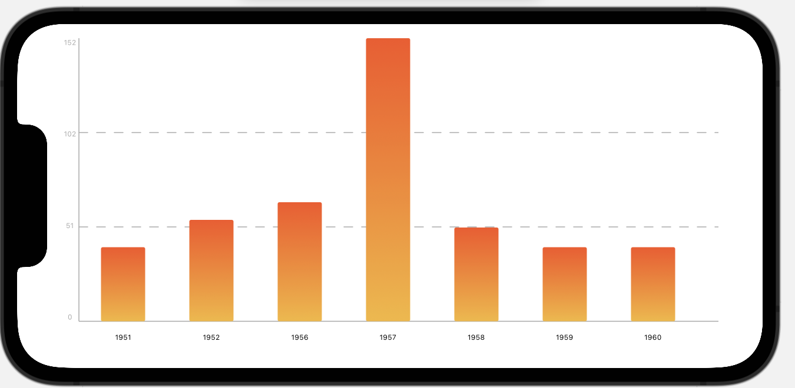
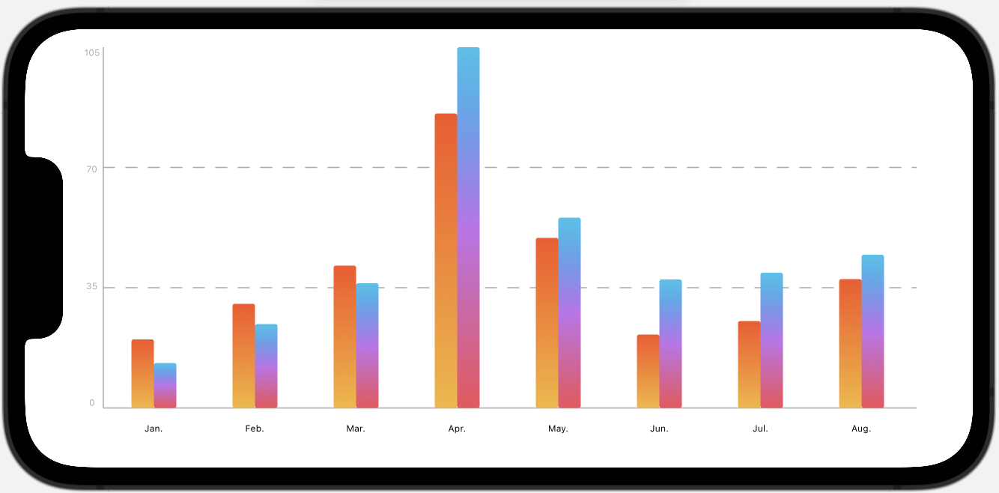
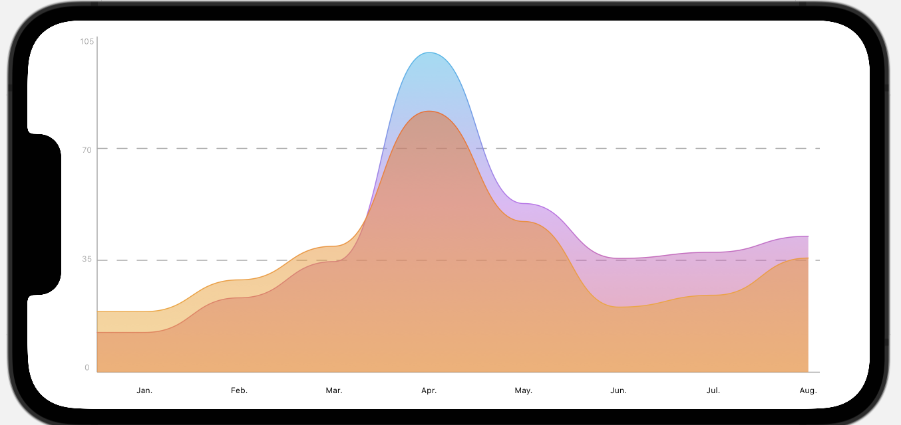
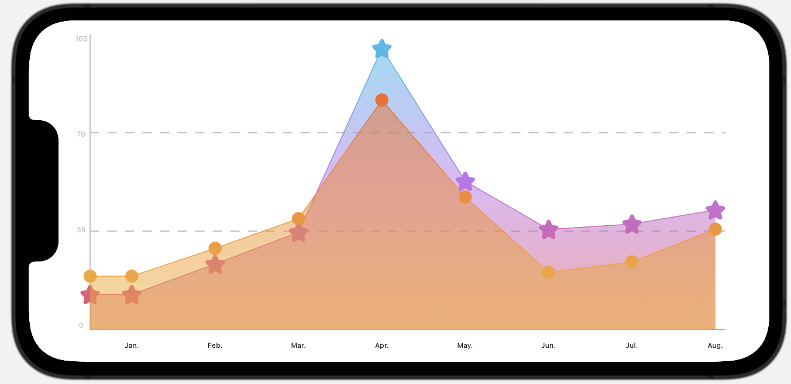
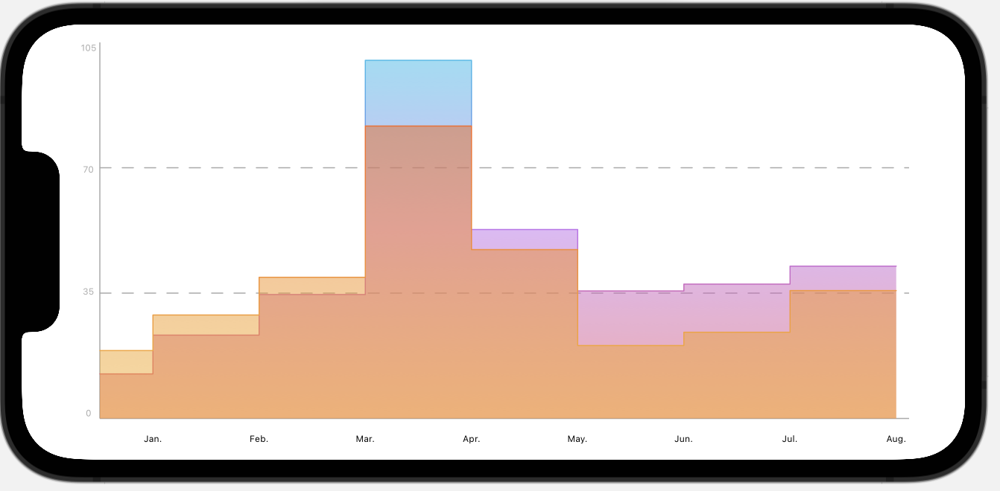
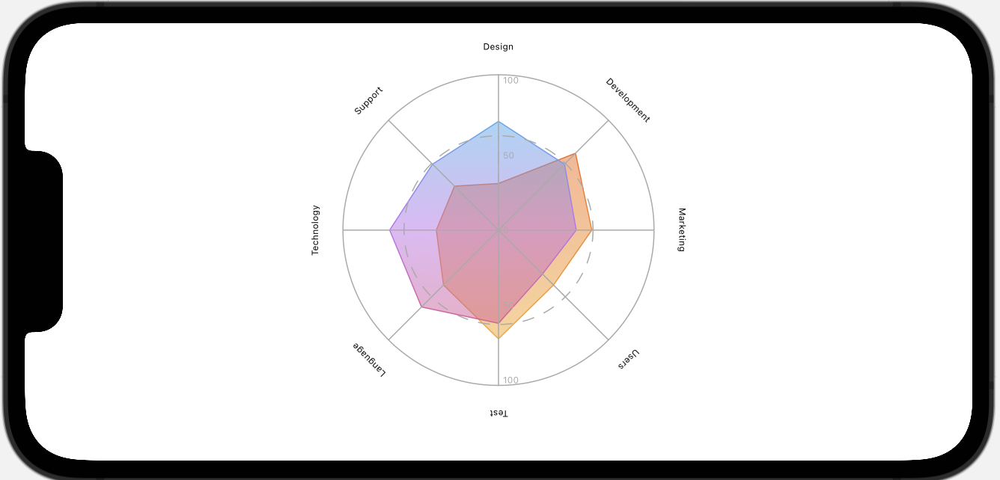
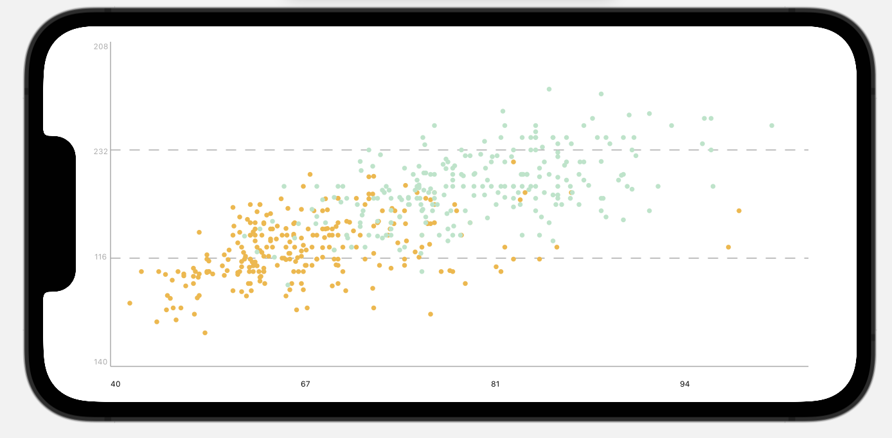

# PrettyAxis
  

A SwiftUI Framework for drawing charts.

## Fearture

- Support Drawing `Bar Chart` `RadarChart`  `Line Chart`  `Scatter Charts` `Pie Chart`  and `Donut Chart`

## Installation

#### Swift Package Manager

If you use Swift Package Manager, simply add PrettyAxis as a dependency of your package in `Package.swift`:

```swift
.package(url: "https://github.com/RiuHDuo/PrettyAxis.git", from: "main")
```

## Quick Start

Using PrettyAxis is very simple,  you can create view like this:

```swift
AxisView(style: .bar, data: values)
```

Currently  `Style` Support： `bar` `line` `radar` `scatter` `pie` and `doughnut`.

`data` is an array of any type which  implements `Axisable` Protocol.

More documents will coming soon.

## Preview

### Bar

- Default



- Group

  

### Line

- smooth

  

- straight

  

- step

  

### Radar



### Scatter



## License

Distributed under the MIT License.